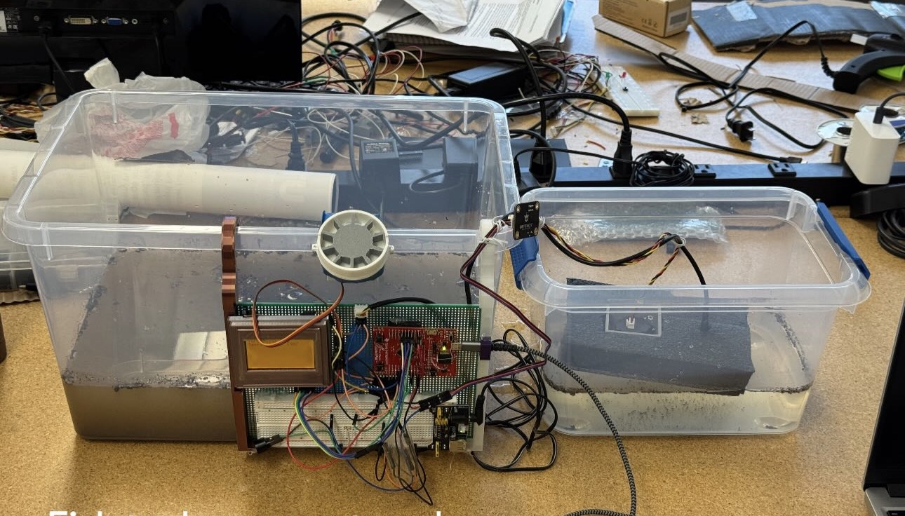

# Automated Aquarium Monitoring System

> University of Texas at Arlington | Senior Design Project

---

## Overview

The Automated Aquarium Monitoring System is an embedded system developed as a Senior Design project at the University of Texas at Arlington.

The project was designed to automate essential aquarium maintenance by continuously monitoring water temperature and turbidity, providing scheduled automatic fish feeding, and displaying system information through an LCD user interface. The system emphasizes affordability, simplicity, and reliability while operating as a fully self-contained embedded solution without requiring cloud connectivity or mobile applications.

Built around a TI TM4C Series microcontroller running a custom real-time operating system (RTOS), the system integrates environmental sensors, a servo-controlled feeding mechanism, an LCD display, pushbutton controls, and an audible alert system to provide reliable aquarium monitoring and care.

---

## Final Prototype

  

*Completed prototype of the Automated Aquarium Monitoring System developed during the University of Texas at Arlington Senior Design project.*

---

## Project Objectives

- Monitor aquarium water temperature in real time.
- Measure water turbidity to detect declining water quality.
- Automate fish feeding using a servo-controlled dispensing mechanism.
- Display sensor readings and system status through an LCD interface.
- Alert users when turbidity exceeds predefined thresholds.
- Provide an affordable and self-contained embedded solution for aquarium monitoring.

---

## Technologies Used

### Hardware

- TI TM4C123GH6PM Microcontroller
- DS18B20 Temperature Sensor
- SEN0189 Turbidity Sensor
- SG90 Servo Motor
- LCD Display
- Pushbuttons
- Active Buzzer
- 3D Printed Mechanical Components

### Software

- Embedded C
- Code Composer Studio
- Custom Real-Time Operating System (RTOS)
- AutoCAD
- Git
- GitHub

---

## My Contributions

This project was completed as a collaborative Senior Design project with a multidisciplinary engineering team.

My contributions included:

- Assisted with integration and setup of the LCD user interface.
- Designed and 3D printed mechanical components using AutoCAD.
- Assisted with soldering, wiring, and hardware assembly.
- Participated in hardware integration and subsystem testing.
- Reviewed embedded software with teammates during development and system validation.
- Collaborated throughout system design, integration, and final project demonstration.

---

## Prototype Highlights

The completed prototype integrates multiple embedded hardware components into a self-contained aquarium monitoring system capable of:

- Real-time temperature monitoring
- Water turbidity monitoring
- LCD-based user interface
- Automated servo-controlled fish feeding
- Audible maintenance alerts
- User-configurable controls through pushbuttons

---

## Engineering Skills Demonstrated

- Embedded Systems Development
- Embedded C Programming
- TM4C123 Microcontroller Development
- Real-Time Operating Systems (RTOS)
- LCD Integration
- Sensor Integration
- Hardware Assembly
- Soldering
- AutoCAD
- 3D Printing
- Hardware Validation
- System Testing
- Technical Documentation
- Team Collaboration

---

## What I Learned

This project strengthened my understanding of:

- Embedded system architecture
- Hardware and software integration
- Real-time embedded systems
- Sensor interfacing
- LCD interface integration
- Mechanical design using AutoCAD
- Hardware assembly and soldering
- System testing and validation
- Collaborative engineering development

---

## About This Repository

This repository documents my participation in the Automated Aquarium Monitoring System Senior Design project and serves as part of my engineering portfolio.

It highlights the project's objectives, technologies used, my individual contributions, and supporting engineering documentation.

---

## Project Documentation

Supporting documentation is available in the **docs** folder.

Included documentation:

- [Final Engineering Report](./docs/Fish_Monitoring_Device.pdf)

---

## Original Team Repository

**Original Team Repository**

*Add your team's GitHub repository link here.*

---

## Acknowledgment

The Automated Aquarium Monitoring System was developed as a collaborative Senior Design project at the University of Texas at Arlington.

This repository documents my participation as a member of the engineering team and highlights my engineering experience. Credit for the complete system design and implementation belongs to the entire Senior Design team.
